# WebTrace AI Pipeline Documentation

## Overview
WebTrace is an AI-powered system that analyzes website screenshots to determine whether they were generated by AI tools or coded by humans. The system uses advanced computer vision techniques to extract 43 comprehensive features and applies machine learning algorithms for classification.

## How It Works

### Step-by-Step Process

1. **Input:** Website screenshot
2. **Feature Extraction:** 43 different features including:
   - **Color Analysis** (12 features): Color diversity, harmony, temperature, vibrancy
   - **Layout Analysis** (10 features): Edge density, symmetry, grid structure, visual hierarchy
   - **Texture Analysis** (8 features): Texture contrast, entropy, energy, homogeneity
   - **Structural Analysis** (9 features): Border regularity, component alignment, design patterns
3. **Model Training:** Three different models trained:
   - **Random Forest** (73.33% accuracy)
   - **Logistic Regression** (95.24% accuracy)
   - **Decision Tree** (93.06% accuracy)
4. **Output:** Classification + probability breakdown

### AI Pipeline Architecture

```mermaid
graph TD
    A[Website Screenshot Input] --> B[Image Preprocessing]
    B --> C[Feature Extraction Engine]
    C --> D[43 Visual Features]
    D --> E[Model Prediction]
    E --> F[Classification Result]
    E --> G[Probability Breakdown]
    
    B --> B1[OpenCV Conversion]
    B --> B2[Image Validation]
    B --> B3[Format Standardization]
    
    C --> C1[Color Analysis]
    C --> C2[Layout Analysis] 
    C --> C3[Texture Analysis]
    C --> C4[Structural Analysis]
    
    C1 --> C1a[Color Diversity]
    C1 --> C1b[Color Uniformity]
    C1 --> C1c[Color Harmony]
    C1 --> C1d[Color Temperature]
    C1 --> C1e[Color Vibrancy]
    C1 --> C1f[Color Consistency]
    
    C2 --> C2a[Edge Density]
    C2 --> C2b[Contour Count]
    C2 --> C2c[Layout Symmetry]
    C2 --> C2d[Spatial Distribution]
    C2 --> C2e[Grid Structure]
    C2 --> C2f[Visual Hierarchy]
    
    C3 --> C3a[Texture Uniformity]
    C3 --> C3b[Texture Contrast]
    C3 --> C3c[Texture Entropy]
    C3 --> C3d[Texture Correlation]
    C3 --> C3e[Texture Energy]
    C3 --> C3f[Texture Homogeneity]
    
    C4 --> C4a[Border Regularity]
    C4 --> C4b[Padding Consistency]
    C4 --> C4c[Element Spacing]
    C4 --> C4d[Component Alignment]
    C4 --> C4e[Design Patterns]
    C4 --> C4f[Layout Balance]
    
    E --> E1[Random Forest Model]
    E --> E2[Logistic Regression Model]
    E --> E3[Decision Tree Model]
    
    F --> F1[AI-Generated]
    F --> F2[Human-Coded]
    
    G --> G1[Model Confidence Scores]
    G --> G2[Feature Importance Analysis]
```



## Technical Implementation Details

### 1. Input Processing
- **Format Conversion**: Website screenshots are converted to OpenCV format (BGR)
- **Image Validation**: Ensures proper dimensions and data integrity
- **Preprocessing**: Standardizes image format for consistent feature extraction

### 2. Feature Computation
The system extracts **43 comprehensive features** across four main categories:

#### Color Features (12 features)
- **Color Diversity**: Measures variation in saturation and value channels
- **Color Uniformity**: Entropy-based measure of color distribution
- **Color Harmony**: Analysis of hue distribution patterns
- **Color Temperature**: Warm vs cool color analysis
- **Color Vibrancy**: Saturation and brightness interaction
- **Color Consistency**: Uniformity of color application

#### Layout Features (10 features)
- **Edge Density**: Concentration of edges in the image
- **Contour Count**: Number of distinct visual elements
- **Layout Symmetry**: Horizontal and vertical symmetry analysis
- **Spatial Distribution**: How elements are distributed across the image
- **Grid Structure**: Detection of grid-like patterns
- **Visual Hierarchy**: Gradient-based hierarchy analysis

#### Texture Features (8 features)
- **Texture Uniformity**: Consistency of texture patterns
- **Texture Contrast**: Variation in texture intensity
- **Texture Entropy**: Information content in texture patterns
- **Texture Correlation**: Spatial correlation between pixels
- **Texture Energy**: Energy distribution in texture
- **Texture Homogeneity**: Uniformity of texture regions

#### Structural Features (9 features)
- **Border Regularity**: Consistency of element borders
- **Padding Consistency**: Uniform spacing around elements
- **Element Spacing**: Average distance between components
- **Component Alignment**: Alignment of visual elements
- **Design Patterns**: Detection of repeated design elements
- **Layout Balance**: Visual weight distribution

### 3. Model Training
Three different machine learning algorithms are trained on the 43 features:

#### Model Performance
- **Improved Logistic Regression**: 95.24% accuracy
- **Custom Decision Tree**: 93.06% accuracy
- **Original Random Forest**: 73.33% accuracy

#### Training Process
1. **Feature Selection**: 39 meaningful features (excluding basic properties)
2. **Data Preprocessing**: Normalization and validation
3. **Model Training**: Cross-validation and hyperparameter tuning
4. **Performance Evaluation**: Accuracy, precision, recall metrics

### 4. Output Generation
The system provides two types of outputs:

#### Binary Classification
- **AI-Generated**: Website created using AI tools
- **Human-Coded**: Website manually coded by developers

#### Probability Breakdown
- **Model Confidence**: Probability scores for each prediction
- **Feature Importance**: Analysis of which features contributed most
- **Tool-Specific Probabilities**: Breakdown by potential AI tools

## Technical Stack

```
┌─────────────────────────────────────────────────────────────────┐
│                        Technical Stack                          │
├─────────────────┬─────────────────┬─────────────────────────────┤
│    Frontend     │    Backend      │      AI Model Training      │
│                 │                 │                             │
│ • React.js      │ • Python Flask  │ • OpenCV                    │
│ • Vite          │ • NumPy         │ • scikit-image              │
│ • Tailwind CSS  │ • scipy         │ • scikit-learn              │
│ • HTML5/CSS3    │ • PIL/Pillow    │ • K-means Clustering        │
│ • JavaScript    │ • JSON          │ • Canny Edge Detection      │
│                 │ • REST API      │ • Hough Transform           │
│                 │ • File Upload   │ • Contour Detection         │
│                 │ • Image Proc.   │ • Gradient Analysis         │
│                 │ • Feature Ext.  │ • Random Forest             │
│                 │ • Model Predict │ • Logistic Regression       │
│                 │ • Result Format │ • Decision Tree             │
└─────────────────┴─────────────────┴─────────────────────────────┘
```

### Core Libraries & Technologies

#### Frontend Stack
- **React.js**: Modern UI framework for interactive components
- **Vite**: Fast build tool and development server
- **Tailwind CSS**: Utility-first CSS framework for styling
- **HTML5/CSS3**: Semantic markup and modern styling
- **JavaScript**: Dynamic functionality and user interactions

#### Backend Stack
- **Python Flask**: Lightweight web framework for API development
- **NumPy**: Numerical computing and array operations
- **scipy**: Scientific computing and statistical functions
- **PIL/Pillow**: Image processing and manipulation
- **JSON**: Data serialization and API communication
- **REST API**: Standardized API endpoints for frontend communication


#### AI/ML Stack
- **OpenCV**: Computer vision and image processing
- **scikit-image**: Advanced image analysis algorithms
- **scikit-learn**: Machine learning algorithms and utilities
- **K-means Clustering**: Color analysis and feature extraction
- **Canny Edge Detection**: Edge density and contour analysis
- **Hough Transform**: Line detection and pattern recognition
- **Contour Detection**: Element identification and counting
- **Gradient Analysis**: Texture and visual flow analysis

### Machine Learning Models
- **Random Forest**: Ensemble learning for robust classification (73.33% accuracy)
- **Logistic Regression**: Linear classification with regularization (95.24% accuracy)
- **Decision Tree**: Interpretable rule-based classification (93.06% accuracy)

## System Architecture

```
┌─────────────────┐    ┌──────────────────┐    ┌─────────────────┐
│   Frontend UI   │    │   Backend API    │    │   ML Pipeline   │
│                 │    │                  │    │                 │
│ • File Upload   │───▶│ • Image Processing│───▶│ • Feature Ext.│
│ • Model Select  │    │ • Feature Ext.   │    │ • Model Predict │
│ • Results Display│   │ • Model Predict  │    │ • Result Format │
└─────────────────┘    └──────────────────┘    └─────────────────┘
                                │
                                ▼
                       ┌──────────────────┐
                       │   Model Storage  │
                       │                  │
                       │ • Trained Models │
                       │ • Feature Maps   │
                       │ • Configuration  │
                       └──────────────────┘
```

## Key Innovations

1. **Comprehensive Feature Set**: 43 carefully engineered features covering all aspects of web design
2. **Multi-Model Ensemble**: Three different algorithms for robust classification
3. **Advanced Computer Vision**: Sophisticated image analysis techniques
4. **Real-time Processing**: Fast feature extraction and prediction
5. **Interpretable Results**: Detailed probability breakdowns and feature importance

## Performance Metrics

- **Overall Accuracy**: 95.24% (best model)
- **Feature Count**: 43 comprehensive visual features
- **Processing Time**: < 2 seconds per image
- **Model Reliability**: Cross-validated performance
- **Scalability**: Handles various image sizes and formats

## Future Enhancements

1. **Deep Learning Integration**: CNN-based feature extraction
2. **Real-time Analysis**: Live website analysis capabilities
3. **Tool-Specific Detection**: Identify specific AI tools used
4. **Mobile Optimization**: Lightweight models for mobile devices
5. **API Integration**: RESTful API for third-party applications

---

*This documentation provides a comprehensive overview of the WebTrace AI pipeline, showcasing the sophisticated computer vision and machine learning techniques used to distinguish between AI-generated and human-coded websites.* 